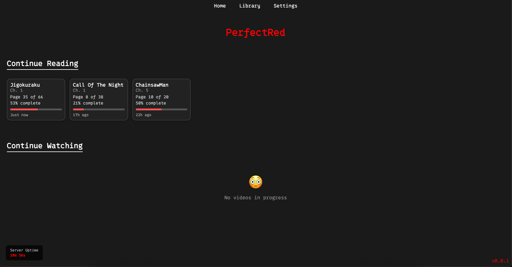
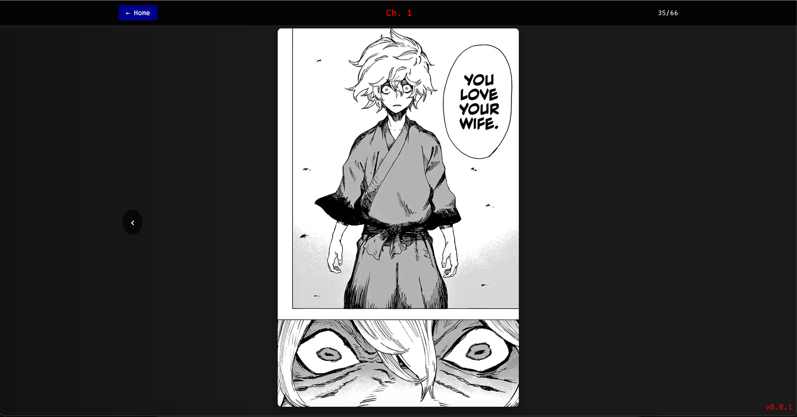
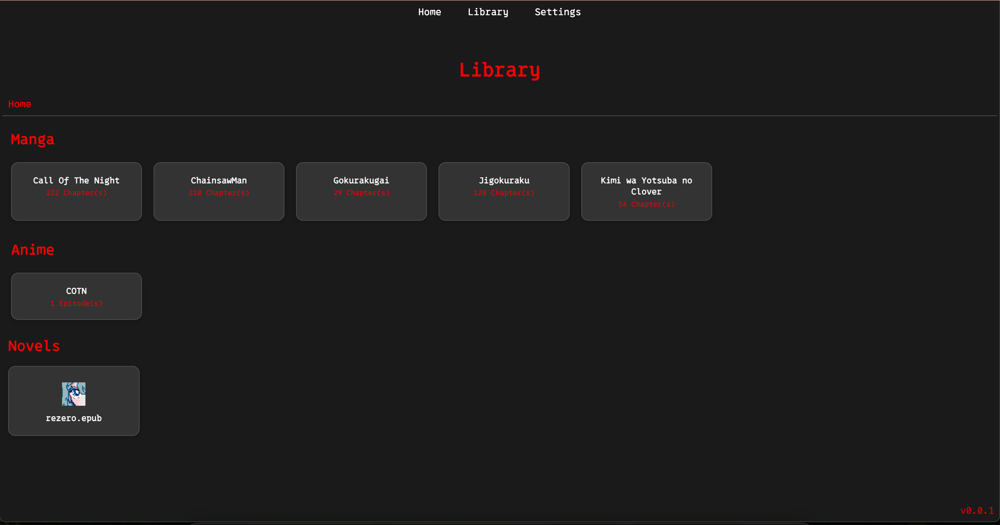

# <span style="color:red">PerfectRed</span>

A fast expressJS localhost manga/anime (anime is kinda bad rn im working on it) watcher/reader
The theme is red :tongue:

---

## ✨ Features
- Supports cbz and zip (i recommend using hakuneko for procuring the files)
- Saves progress in neat tiles.
- Fast file retrieval and regex match.
- Nice theme!

---

## 🗺️ Roadmap
- I want to add better anime support
- A login system (cookies are quite bad right now
- Cover images from manga folder (i use a static image because the covers didnt scale very well

---

## 📸 Preview

### Homepage View



### Reader UI


### Library View


---

## Getting Started

### Install
```bash
git clone https://github.com/crashpenguin/PerfectRed.git
```

Run the install.bat or run npm install inside the perfectred directory and this will install the dependencies.

run the install.sh for mac or linux and install.bat for windows

put your mangas in data/ in the format of folders full of chapter [#].cbz
